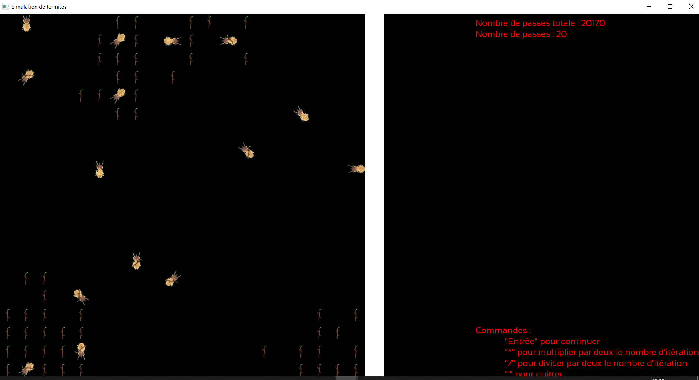
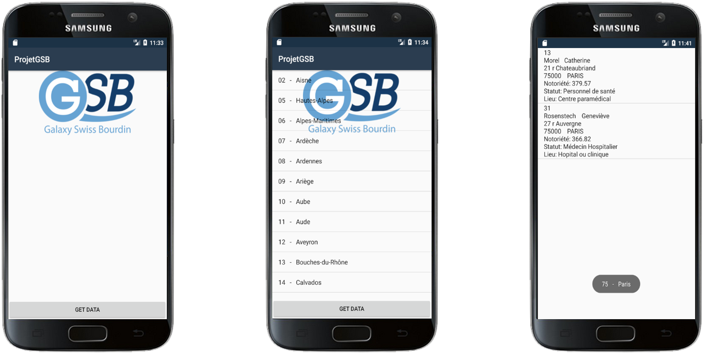
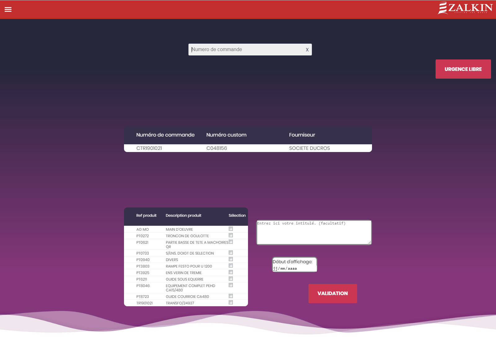
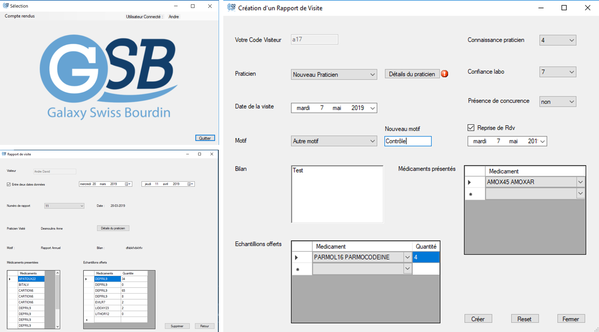
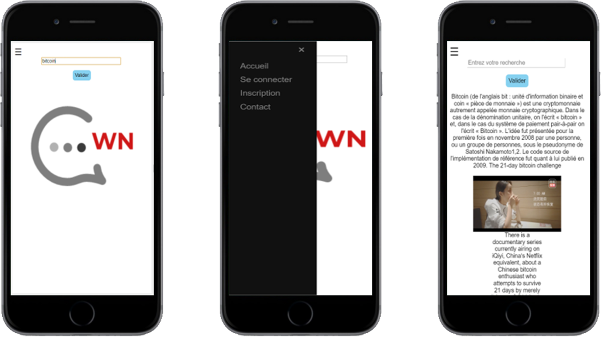
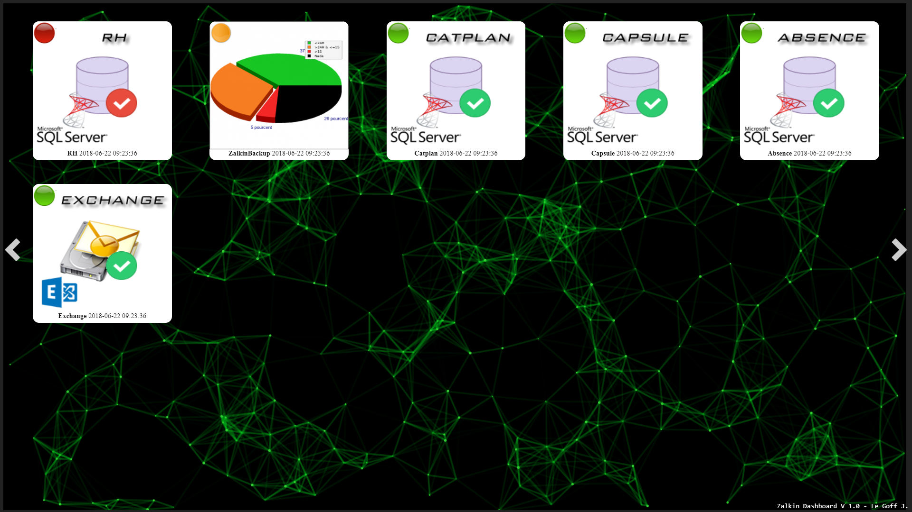
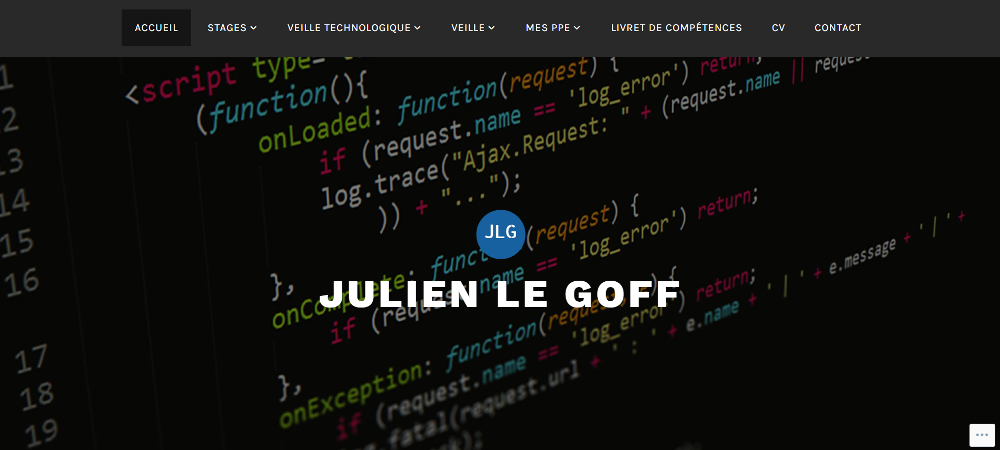
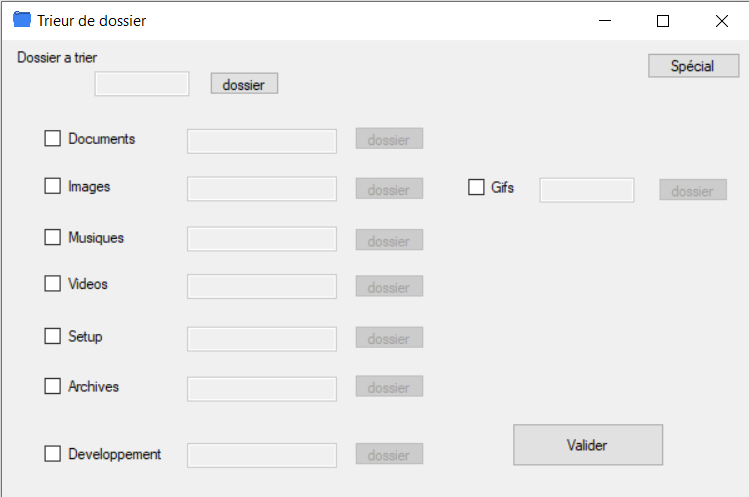
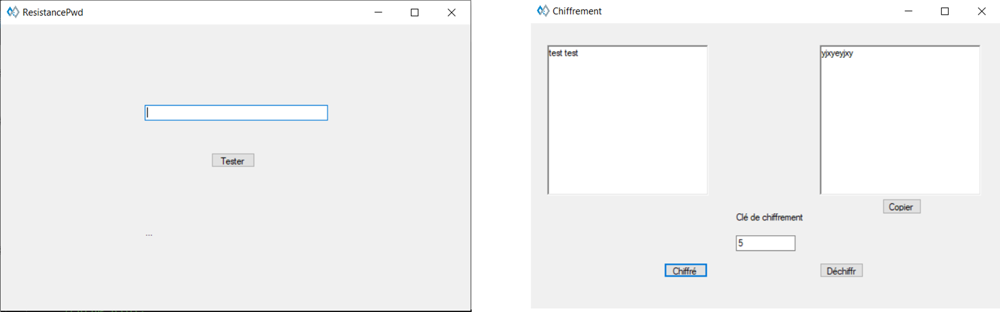

# Mon Portfolio

Il s'agit d'un répertoire ou je liste mes anciens et mes actuelles projets.
J'ai réalisé cette liste en attendant de refaire mon portfolio en ligne.

## Table of contents

* [Termites](#Termites)
* [Images](#Images)
* [GSB Mobile](#GSB-Mobile)
* [Zalkin SID](#Zalkin-SID)
* [GSB Rapport de Visite](#GSB-Rapport-de-Visite)
* [WordNews](#WordNews)
* [Zalkin Dashboard](#Zalkin-Dashboard)
* [Portfolio BTS](#Portfolio-BTS)
* [Projets personnels](#projets-personnels)
    * [Drive Saver](#Drive-Saver)
    * [Trieur de Dossier](#Trieur-de-Dossier)
    * [Kali](#)
    * [MiniGame](#)

## Termites

`2020` - `C++`, `SFML`, `CodeBlocks`, `Logiciel`, `Simulation`

J'ai créé dans le cadre de ma licence à l'université Paris-Sud, ce projet de 2ème semestre qui est un simulateur de termites. Ce logiciel recrer le comportement des termites qui souhaitent rassembler des brindilles en tas. La bibliothèque graphique SFML m'a permis de créer un affichage beaucoup plus convaincant que la console.

## Images

`2019` - `C++`, `Visual Studio`, `Bibliothèque`, `Traitement d'images`

J'ai créé dans le cadre de ma licence à l'université Paris-Sud, ce projet de 1er semestre qui est une bibliothèque de traitement d'image. Cette bibliothèque permet de traiter des images: conversion en noir et blanc, inversion des couleurs, extraction des contours.

Projet réalisé en binôme.

## GSB Mobile

`2019` - `C#`, `Xamarin`, `API`, `SQL`, `Visual Studio`, `Application Mobile`

J'ai développé comme client léger pour mon projet de fin de BTS, une application mobile permettant via une API que j'ai également développé d'obtenir les informations des médecins présents dans un département choisi.
Ce projet m'a permis une première vraie expérience à la fois dans la création d'API mais également dans celle des applications mobiles.

Compte rendu complet disponible ici : https://legoffjulien27.wordpress.com/gsb-mobile/

## Zalkin SID

`2019` - `PHP`, `JavaScript`, `CSS`, `SQL`, `ERP`, `Web`

J'ai pu pendant ce stage développé en PHP un site web permettant la communication entre deux services de l'entreprise via un écran d'affichage affichant les pièces urgentes de machines à réceptionner.
Ce site est divisé en 3 variantes, la 1ere permet après une requête vers Syteline (l'ERP de l'entreprise) d'obtenir la liste des commandes passées et de sélectionner les pièces urgentes pour créer une 'urgence', elle permet également d'avoir accès à l'historique des 'ugences' ou de faire une mise à jour. Le 2nd est un affichage destiné pour un grand écran affichant les 'urgences' par ordre d'arriver, le dernier est une interface permettant de valider l'urgence traitée.

Compte rendu disponible ici : https://legoffjulien27.files.wordpress.com/2019/02/stagezalkin2jlg-1.pdf

## GSB Rapport de Visite

`2018-2019` - `C#`, `SQL`, `Visual Studio`, `Logiciel`

J'ai réalisé comme client lourd pour mon projet de fin d'année de BTS un logiciel de rapport de visites pour les praticiens de l'entreprise de médicaments GSB (factice).
Il s'agit d'un logiciel avec identification, permettant de voir les rapports effectués par un visiteur (ou les rapports effectués par chaque visiteurs pour un responsable), il permet également d'en éditer et d'ajouter des praticiens à la base de données.

Compte rendu complet disponible ici : https://legoffjulien27.wordpress.com/gsb-c/

Projet réalisé en binôme.
Travail effectué : partie création de rapport de visite et base de données.

## WordNews

`2018` - `PHP`, `JavaScript`, `API`, `SQL`, `Application Mobile`

J'ai participé en 2018 au concours de créativité numérique du Lycée Gustave Flaubert, qui se déroulait sur une semaine et qui avait pour thème "Savoirs Connaissances Informations". J'ai pu réaliser en duo une application mobile permettant à partir d'un mot-clé d'obtenir une courte définition ainsi que les derniers articles à ce sujet. Ce projet entièrement réalisé en PHP fut intéressant car il m'a permis de découvrir les API, il a par ailleurs obtenu la 4ème place au concours.

## Zalkin Dashboard

`2018` - `PHP`, `JavaScript`, `JQuery`, `AJAX`, `CodeIgniter`, `SQL`, `SublimText`

J'ai pu pendant ce stage développé avec le framework CodeIgniter un site web dynamique affichant les informations du réseau informatique de l'entreprise (statistiques à propos des serveurs, des sauvegardes, etc.).

## Portfolio BTS

`2017-2018` - `Wordpress`

Il s'agit de mon premier site Wordpress réalisé pour mon BTS. Ce portfolio a servi à contenir toutes les informations pour mes épreuves E4 et E6.

Lien : https://legoffjulien27.wordpress.com

## Projets personnels

Les projets suivants sont des projets assez récents que j'ai réalisé sur mon temps libre et que je continue d'améliorer.

### Drive Saver

Ce logiciel en cours de développement va permettre de faire des sauvegardes incrémentales soit vers un disque dur, soit vers un cloud (google drive, one drive, dropbox), son but à terme est de permettre une bonne synchronisation entre deux ordinateurs.

`2020` - `C#`, `Logiciel`

### Trieur de Dossier

Il s'agit ici d'un programme qui permet de trier un dossier. L'utilisateur sélectionne un dossier source et des dossiers cibles pour les types de fichiers qu'il souhaite trier (image, document, vidéo) et le programme génère un fichier .bat qui trie automatiquement le dossier cible et qui est réutilisable.

`2018-2020` - `C#`, `MS-DOS`, `Logiciel`

### Kali

Logiciel que j'ai développé pour utiliser les informations apprises en cours de sécurité informatique. Ce programme permet d'évaluer la robustesse d'un mot de passe face à une attaque par brut force, il possède également chiffreur/déchiffreur de texte avec une sorte de code de césar qui fonctionne avec une clé que l'on rentre.

`2019` - `C#`, `Logiciel`

### MiniGame

Petit projet que j'ai fait après avoir commencé à apprendre le C++, il s'agit d'un simple jeu de combat en tour par tour entre deux personnages, le tout en dans une console. Je compte l'améliorer à l'avenir, pour l'instant il ne prend en compte que l'attaque, la défense et la vitesse d'un personnage.

`2019` - `C++`, `jeu` 